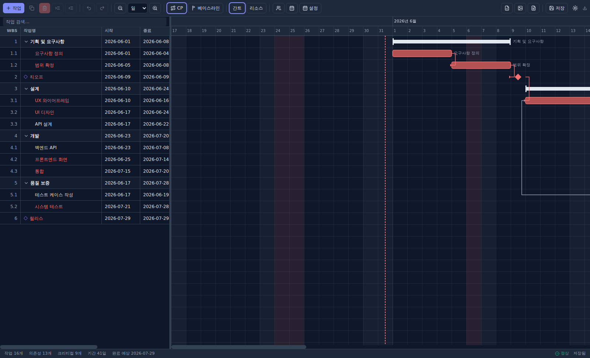
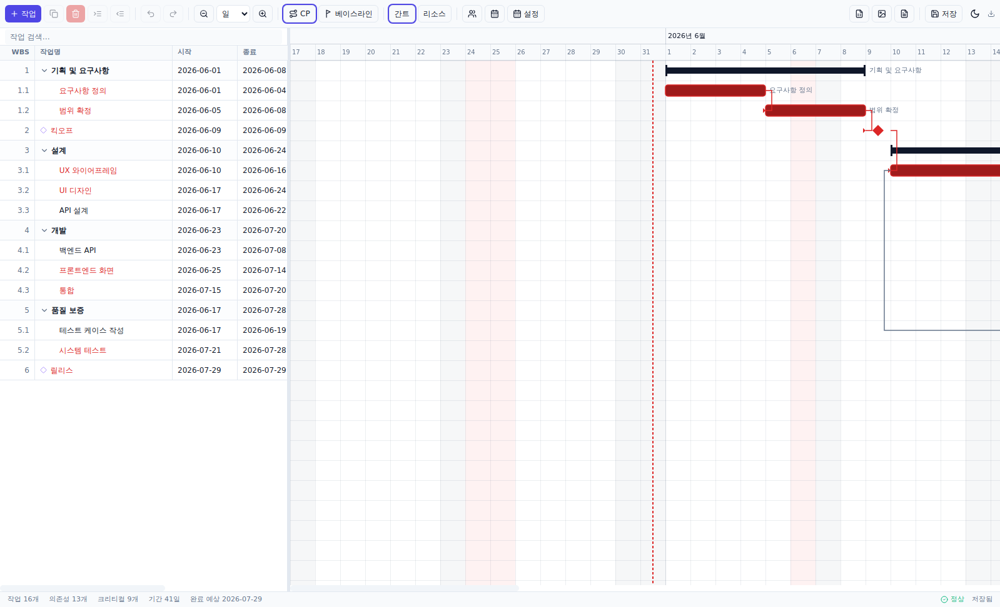
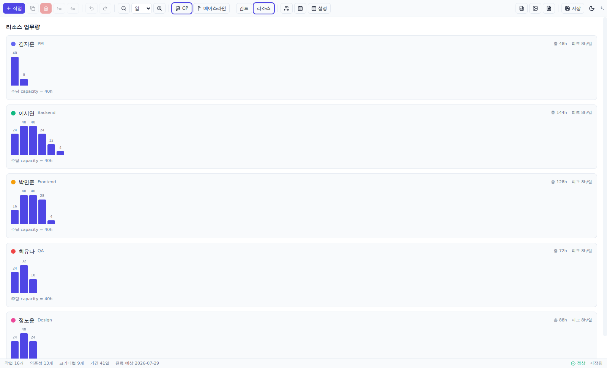

# Smart Gantt — 스마트 간트차트 데스크톱 애플리케이션

서버·클라우드 의존 없이 **로컬에서 독립 실행**되는 고성능 프로젝트 일정 관리(간트차트) 데스크톱 앱입니다.
Electron + React + TypeScript(strict) 기반이며, 대규모 일정(작업 10,000개+/의존성 30,000개+)에서도
가상화 렌더링으로 부드럽게 동작하도록 설계했습니다.

### 화면

| 간트 (다크) | 간트 (라이트) | 리소스 업무량 |
| --- | --- | --- |
|  |  |  |

> 빨간 막대 = 크리티컬 패스, 다이아몬드 = 마일스톤, 빨간 점선 = 오늘, 연한 음영 = 주말/공휴일.

---

## 핵심 기능

| 영역 | 내용 |
| --- | --- |
| **WBS 그리드** | 계층 구조, 접기/펼치기, 인라인 편집(날짜는 달력 선택), 컬럼 리사이즈/정렬/필터, 다중 선택, 가상 스크롤, **엑셀 붙여넣기(클립보드 일괄 추가)** |
| **간트 타임라인** | Canvas 렌더링, 6단계 줌(시간/일/주/월/분기/연), 드래그 이동·기간 조절, 의존성 드래그 연결, Today 라인, 주말/공휴일 음영, Sticky 헤더, Space/휠 패닝 |
| **달력 뷰** | 월 단위 달력 형태로 작업을 색상 칩으로 표시, 마일스톤 다이아몬드, 주말 음영, 오늘 강조, 이전/다음 달 이동 |
| **보기 그룹 / 필터** | 보기 그룹(보고 싶은 작업만 모으기) 생성·색상·이름 관리, 선택 항목을 그룹에 담기, 그룹/선택 항목만 필터링 — 그리드·간트·달력에 동시 적용 |
| **스마트 일정 엔진** | 작업일/캘린더 일수 모드, 주말·대한민국 공휴일(대체공휴일 포함) 제외, FS/SS/FF/SF 의존성 + lag, 제약(ASAP/SNET/MSO/MFO), 부모 자동 집계 |
| **크리티컬 패스** | CPM 정·역방향 패스, Total/Free Float, 완료 예상일, 빨간색 강조 |
| **리소스** | 담당자 등록/할당, 주별 업무량 차트, 일 capacity 초과(과부하) 감지 |
| **베이스라인** | 계획 스냅샷 저장, 계획 vs 실제 편차/지연률, 간트 오버레이 |
| **Export** | Excel(.xlsx, 스타일·색상·아웃라인), PNG(고해상도 전체 타임라인), PDF |
| **신뢰성** | Undo/Redo(≥100단계), 1분 자동 저장, 비정상 종료 복구 배너 |
| **UX** | 라이트/다크 테마(즉시 전환), 전역 단축키, 키보드 포커스, 고대비 포커스 링 |

---

## 기술 스택

- **런타임**: Electron 32 (contextIsolation ✅ / nodeIntegration ❌ / 타입드 preload 브릿지)
- **프론트엔드**: React 18, TypeScript(strict), Vite 5
- **상태관리**: Zustand (단일 write 경로 + 파생 스케줄 캐시)
- **스타일**: Tailwind CSS (CSS 변수 기반 테마 토큰)
- **날짜**: date-fns (ISO `YYYY-MM-DD` 문자열 모델)
- **저장**: 로컬 JSON (Electron `userData`), 브라우저 fallback은 localStorage —
  동일한 `Repository` 인터페이스 뒤에 SQLite 구현을 끼워 넣을 수 있습니다.
- **Export**: ExcelJS, jsPDF, Canvas
- **테스트**: Vitest

---

## 아키텍처 (기능 단위 구조)

```
electron/            # 메인 프로세스 + preload 브릿지 + IPC(저장/자동저장/내보내기)
src/
  entities/          # 도메인 모델: Task, Dependency, Resource, Calendar, Holiday, Baseline, Project
  services/
    scheduler/       # WorkingCalendar(작업일 계산) + 전방 스케줄 엔진
    dependency/      # 의존성 그래프(위상정렬/순환탐지)
    critical-path/   # CPM(크리티컬 패스 + Float)
    holiday/         # 대한민국 공휴일 생성기(대체공휴일 규칙)
    resource/        # 리소스 업무량/과부하 계산
    persistence/     # 프로젝트 저장소 + 자동저장 저장소
    export/          # Excel / PNG / PDF + 전체 캔버스 렌더
  features/
    grid/            # WBS 데이터 그리드(가상화, 인라인 편집)
    gantt/           # Canvas 간트 렌더러 + 타임라인/줌/색상
    toolbar/  statusbar/  resources/  dialogs/
  app/store/         # Zustand 스토어 + 파생 스케줄(recalc)
  shared/            # date 유틸, UI 프리미티브, 훅, preload 브릿지
tests/               # Vitest 단위/통합 테스트
```

**데이터 흐름**: 모든 편집은 스토어의 단일 `commit()` 경로를 지나며 → 깊은 복제로 undo 스냅샷 적재 →
`recalc()`(스케줄 + CPM 재계산) → 파생 상태 갱신 → 자동저장 예약. 렌더 컴포넌트는 파생 결과만 읽습니다.

---

## 실행 방법

```bash
npm install      # 의존성 설치
npm run dev      # Electron 개발 모드 (Vite + 핫리로드)
```

## 빌드 / 검증

```bash
npm run typecheck   # tsc strict 타입 검사
npm test            # Vitest 단위/통합 테스트
npm run build       # 타입 검사 + 렌더러/메인/preload 번들
```

## 배포 (패키징)

```bash
npm run dist        # 현재 OS용 설치본
npm run dist:win    # Windows NSIS 설치본(.exe)
```

산출물은 `release/` 에 생성됩니다. 설정은 `electron-builder.yml` 참고
(Windows NSIS, macOS dmg, Linux AppImage 타깃 정의).

---

## 성능 설계

- **가상화**: 그리드·간트 모두 보이는 행/열만 렌더(스크롤 시 viewport 윈도잉).
- **Canvas 레이어**: 헤더/본문 캔버스 분리, devicePixelRatio 대응, 보이는 막대만 그림.
- **파생 캐시**: 스케줄·CPM 결과를 스토어에 캐시하고 `useMemo`로 트리/타임라인 재계산 최소화.
- **무거운 전역 리렌더 방지**: 컴포넌트는 필요한 슬라이스만 selector로 구독.

대규모 데이터 점검용으로 `createLargeProject(phaseCount, tasksPerPhase)`
(`src/data/sampleData.ts`)를 제공합니다(기본 200×50 = 10,000 작업).

---

## 단축키

| 키 | 동작 |
| --- | --- |
| `Ctrl/Cmd+Z` / `Ctrl/Cmd+Y` | 실행 취소 / 다시 실행 |
| `Ctrl/Cmd+C` / `V` / `D` | 복사 / 붙여넣기 / 복제 |
| `Ctrl/Cmd+S` | 저장 |
| `Delete` / `Backspace` | 선택 작업 삭제 |
| `Tab` / `Shift+Tab` | 들여쓰기 / 내어쓰기 (그리드) |
| `+` / `-` | 확대 / 축소 |
| `Space`+드래그 / 가운데 버튼 | 타임라인 패닝 |
| `Ctrl`+휠 | 줌 |
| `Alt`+막대 드래그 | 의존성 연결 |

---

## 향후 확장 (설계 시 고려됨)

다중 프로젝트 탭 · 협업 모드 · 플러그인 시스템 · AI 일정 추천 · Jira 연동 · MS Project Import.
도메인 모델·저장소·엔진이 UI와 분리되어 있어 위 기능을 점진적으로 얹을 수 있습니다.
